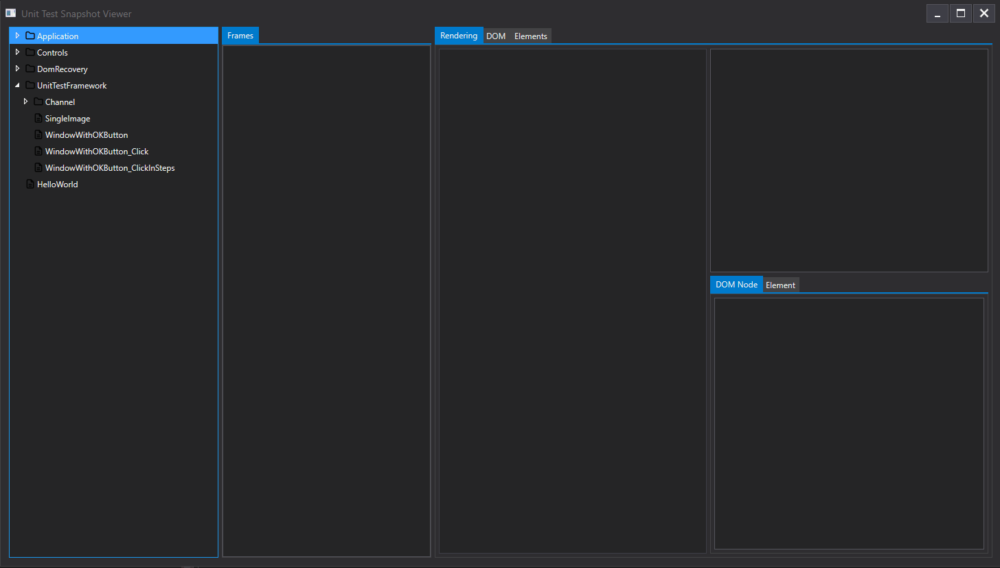

# GacUI

**GPU Accelerated C++ User Interface, with WYSIWYG developing tools, XML supports, built-in data binding and MVVM features.**

## License

**Read the [LICENSE](https://github.com/vczh-libraries/GacUI/blob/master/LICENSE.md) first.**

This project is licensed under [the License repo](https://github.com/vczh-libraries/License).

Source code in this repo is for reference only, please use the source code in [the Release repo](https://github.com/vczh-libraries/Release).

You are welcome to contribute to this repo by opening pull requests.

## Document

For **Home Page**: click [here](http://vczh-libraries.github.io)

For **Gaclib**: click [here](http://vczh-libraries.github.io/doc/current/home.html)

For **GacUI**: click [here](http://vczh-libraries.github.io/doc/current/gacui/home.html)

[gaclib.net](http://gaclib.net/) is a mirror to github pages above.

The deepwiki website [indexed GacUI](https://deepwiki.com/vczh-libraries/GacUI), it provides high level ideas with acceptable accuracy, but it is problematic in details.

## Content of This Project

- The [Tutorial](http://vczh-libraries.github.io/doc/current/gacui/running.html) shows how to start using this marvelous GUI library.
- The [Demos](http://vczh-libraries.github.io/demo.html) section shows you all demos using this GUI library.

### Notice

Using this library requires you to use C++ source files directly in

- The [Release folder](https://github.com/vczh-libraries/GacUI/tree/master/Release) for Vlpp, Workflow or GacUI.
- The [GacGen.exe](https://github.com/vczh-libraries/GacUI/tree/master/Tools/GacGen) if you prefer to use XML to build your UI.

All other files are for library development only.

### Content

This GUI library provides the following features:

- Develop your GUI using pure C++, [Workflow](https://github.com/vczh-libraries/Workflow) script, XML or even JavaScript (under construction).
- Cross-platform abilities.
  - for **Windows**: [Release repo](https://github.com/vczh-libraries/Release)
  - for **Linux**: [XGac repo](https://github.com/vczh-libraries/gGac) (beta release)
  - for **macOS**: [iGac repo](https://github.com/vczh-libraries/iGac) (beta release)
  - for running in **Browser** using WASM: (2.0)
- Rich control library. Container controls supports MVC and virtual list mode.
- Control template system. You can write your own.
- GPU acceleration.
- XML resource supports.
  - You can use the provided [GacGen.exe](https://github.com/vczh-libraries/GacUI/tree/master/Tools/GacGen) to generate multiple XML files with binary resources (images) into a compressed binary format.
  - This program will also generate C++ code behind for you. You can fill event handlers (but we suggest you use MVVM and Data Binding instead) in generated C++ files.
  - If you update your UI, GacGen.exe will merge your modification in C++ code and modification in XML together to generate new C++ code behind. Your update will still exist.
    - **NOTE**: You will see a very obvious mark `USERIMPL(/* ... */)` in the generated code. Here is where you want to add your code. All your modification outside of these places will be discarded on the next GacGen.exe run.
- MVVM and Data Binding.
  - You can define interfaces that required to build your own MVVM pattern in XML and [GacGen.exe](https://github.com/vczh-libraries/GacUI/tree/master/Tools/GacGen) will generate the C++ interface declaration for you.
  - You can also use [Workflow](https://github.com/vczh-libraries/Workflow) expressions in Data Binding and statements in event handlers (instead of writing C++ code in code behind).

https://gankra.github.io/blah/text-hates-you/  
https://lord.io/text-editing-hates-you-too/

### Remote Protocol Support

GacUI Remote Protocol enables Core and Renderer to run in different process in any programming language. It is current under development, but if you are interested in it, there are demos to try.

All text box related controls are not supported yet, but they are on the way!

#### NamedPipe and Http

In **GacUISrc.sln** there are two projects:
- [RemotingTest_Core.vcxproj](https://github.com/vczh-libraries/GacUI/tree/master/Test/GacUISrc/RemotingTest_Core)
- [RemotingTest_Rendering_Win32.vcxproj](https://github.com/vczh-libraries/GacUI/tree/master/Test/GacUISrc/RemotingTest_Rendering_Win32)

You must offer the same command line argument to `Core` and then `Rendering_Win32` to play with the demo.
- `Core` starts a GacUI process but delegates all rendering work to a remote process.
- `Rendering_Win32` starts a renderer-only process handles `Core`'s requests.
- One of `/Pipe` or `/Http` should be offered to both projects so that they can connect to each other.

#### HTML

By running `Core` with `/Http`, you can even [run GacUI in a browser](https://github.com/vczh-libraries/GacJS)!

#### Unit Test

With the power from Remote Protocol, you could make GacUI running and writing down snapshots as a trace of all UI activities.
Check out [UnitTest.vcxproj](https://github.com/vczh-libraries/GacUI/tree/master/Test/GacUISrc/UnitTest)!

After running all test cases (actually don't need to do that as all snapshots are already checked in),
check out [UnitTestViewer.vcxproj](https://github.com/vczh-libraries/GacUI/tree/master/Test/GacUISrc/UnitTestViewer)!

Unit test facility and the viewer are released to the [Release repo](https://github.com/vczh-libraries/Release/tree/master/Import) in:
- GacUI.UnitTest.(h|cpp)
- GacUI.UnitTest.UI(h|cpp)
- GacUI.UnitTest.UIReflection(h|cpp): only needed when you run GacUI.UnitTest.UI.cpp without `VCZH_DEBUG_NO_REFLECTION` compiler option.

