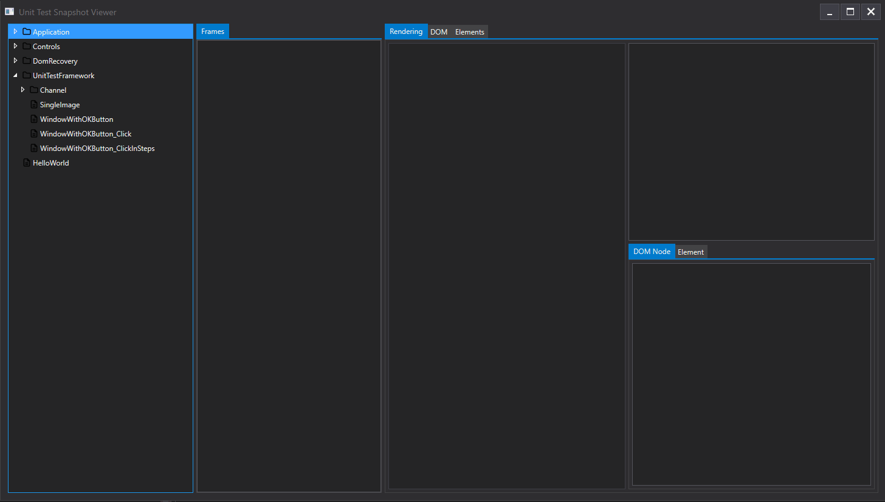

# GacUI

GPU Accelerated C++ User Interface, with:
- Cross-platform supports (Windows, Linux, macos, HTML5)
  - Native Renderers
  - Hosted Mode to render all windows in one native window (optional)
  - Core/Renderer cross-process separation (optional)
- Built-in powerful text processing libraries
- Built-in data binding and MVVM features
- XML UI description embedding Workflow script language
  - Dynamic loading with C++ dynamic reflection opt-in
    - Allow loading foreign UI with complex behavior in runtime
  - Generate XML and Workflow to C++ source files for static linking (recommended)
    - Allow C++ dyanmic reflection opt-out to significantly improve performance and reduce binary size
- FFI Integration with other programming languages (under development)

## Coding Agent Supports

- Rich context, instructions and documentation for developing with coding agents
- GacUI applications UI can be understand and operated by coding agents meanwhile:
  - Works even when the screen is locked.
  - Does not block you from using the computer.

## License

**Read the [LICENSE](https://github.com/vczh-libraries/GacUI/blob/master/LICENSE.md) first.**

This project is licensed under [the License repo](https://github.com/vczh-libraries/License).

Source code in this repo is for reference only, please use the source code in [the Release repo](https://github.com/vczh-libraries/Release).

You are welcome to contribute to this repo by opening pull requests.

## Document

For **Home Page**: click [here](http://vczh-libraries.github.io)

For **Gaclib**: click [here](http://vczh-libraries.github.io/doc/current/home.html)

For **GacUI**: click [here](http://vczh-libraries.github.io/doc/current/gacui/home.html)

[gaclib.net](http://gaclib.net/) is a mirror to github pages above.

## Content of This Project

- The [Tutorial](http://vczh-libraries.github.io/doc/current/gacui/running.html) shows how to start using this marvelous GUI library.
- The [Demos](http://vczh-libraries.github.io/demo.html) section shows you all demos using this GUI library.

### Notice

Using this library requires you to use C++ source files directly in

- The [Release folder](https://github.com/vczh-libraries/GacUI/tree/master/Release) for Vlpp, Workflow or GacUI.
- The [GacGen.exe](https://github.com/vczh-libraries/GacUI/tree/master/Tools/GacGen) if you prefer to use XML to build your UI.
- The [GacBuild.ps1](https://github.com/vczh-libraries/Release/blob/master/Tools/GacBuild.ps1) if you are build your application with multiple GacUI XML Resource with dependencies.

All other files are for library development only.

### Content

This GUI library provides the following features:

- Develop your GUI using pure C++, [Workflow](https://github.com/vczh-libraries/Workflow) script, XML or even JavaScript (under construction).
- Cross-platform abilities.
  - for **Windows**: [Release repo](https://github.com/vczh-libraries/Release)
  - for **Linux**: [wGac repo](https://github.com/vczh-libraries/wGac)
  - for **macOS**: [iGac repo](https://github.com/vczh-libraries/iGac)
  - for running in **Browser** using WASM: (2.0)
- Rich control library. Container controls supports MVC and virtual list mode.
- Control template system. You can write your own.
- GPU acceleration.
- XML resource supports.
  - You can use the provided [GacGen.exe](https://github.com/vczh-libraries/GacUI/tree/master/Tools/GacGen) or [GacBuild.ps1](https://github.com/vczh-libraries/Release/blob/master/Tools/GacBuild.ps1) to generate from multiple XML files to binary resources (images) into a compressed binary format.
  - This program will also generate C++ code behind for you. You can fill event handlers (but we suggest you use MVVM and Data Binding instead) in generated C++ files.
  - If you update your UI, GacGen.exe will merge your modification in C++ code and modification in XML together to generate new C++ code behind. Your update will still exist.
    - **NOTE**: You will see a very obvious mark `USERIMPL(/* ... */)` in the generated code. Here is where you want to add your code. All your modification outside of these places will be discarded on the next GacGen.exe run.
- MVVM and Data Binding.
  - You can define interfaces that required to build your own MVVM pattern in XML and [GacGen.exe](https://github.com/vczh-libraries/GacUI/tree/master/Tools/GacGen) will generate the C++ interface declaration for you.
  - You can also use [Workflow](https://github.com/vczh-libraries/Workflow) expressions in Data Binding and statements in event handlers (instead of writing C++ code in code behind).

https://gankra.github.io/blah/text-hates-you/  
https://lord.io/text-editing-hates-you-too/

### Automation Support for Coding Agent

Since UI Automation is not working when the screen is locked, GacUI prepares facilities to expose UIA features by a http server brought up with the app. This service should be explicitly activated in the source code for security reason.

Applications compose automation directly: construct the concrete service matching the active normal, hosted, core, or renderer controller; substitute it; start either the Windows HTTP or MiniHTTP endpoint; run `GuiApplication`; then stop the endpoint and service before unsubstituting it. Windows HTTP and cross-platform MiniHTTP expose the same `Controls`, `Dom`, and `IO` contract. MiniHTTP is used by the remoting demos and is not part of GacUI's public API yet.

### Remote Protocol Support

GacUI Remote Protocol enables Core and Renderer to run in different process in any programming language. It is current under development, but if you are interested in it, there are demos to try.

All text box related controls are not supported yet, but they are on the way!

#### Named Pipe, HTTP, and MiniHTTP

In **GacUISrc.sln** the remoting and remote-view-model demos use these projects:
- [RemotingTest_Core.vcxproj](https://github.com/vczh-libraries/GacUI/tree/master/Test/GacUISrc/RemotingTest_Core)
- [RemotingTest_Rendering_Win32.vcxproj](https://github.com/vczh-libraries/GacUI/tree/master/Test/GacUISrc/RemotingTest_Rendering_Win32)
- [RemotingTest_RvmHost.vcxproj](https://github.com/vczh-libraries/GacUI/tree/master/Test/GacUISrc/RemotingTest_RvmHost)
- [CppTest_Rvm.vcxproj](https://github.com/vczh-libraries/GacUI/tree/master/Test/GacUISrc/CppTest_Rvm)

You must offer the same transport argument to every process in one run.
- `Core` starts a GacUI process but delegates all rendering work to a remote process.
- `Rendering_Win32` starts a renderer-only process handles `Core`'s requests.
- `RemotingTest_RvmHost` provides the service required by `/RVMT`. It advertises `ViewModelChannel` for RPC and the internal `ViewModelReadyChannel` startup signal; renderers advertise only `GacUIRemoteProtocol`.
- `CppTest_Rvm` is the Windows-only local variant. It runs the generated application with `RemotingTest_RvmHost`, without a renderer process.
- Exactly one of `/Pipe`, `/Http` or `/MiniHttp` should be offered to each participating project.
  - Non-Windows platform only enabled `/MiniHttp`.
- Offer `/FCT` (default), `/RPT` or `/RVMT` to `Core`.
- For `/FCT` and `/RPT`, start `Core` and then the renderer.
- For `/RVMT`, start `Core` first. It intentionally blocks while waiting for `RemotingTest_RvmHost`; while it is blocked, start `RemotingTest_RvmHost`. After Core's `http://localhost:8888/Automation/RemotingTest_Core/Controls` response contains the `Remote View Model Test` window, start the renderer.
- For the Windows-only local variant, start `CppTest_Rvm` first. It intentionally blocks while waiting for `RemotingTest_RvmHost`; while it is blocked, start `RemotingTest_RvmHost`. This variant does not use a renderer. `/Pipe` and `/Http` expose automation through Windows HTTP; `/MiniHttp` registers automation on the same port-8888 MiniHTTP socket server used for RVM traffic.
- The RVM demos intentionally use a simple ordered-start contract. If `RemotingTest_RvmHost` disconnects while a requester is running, the requester terminates with an error and the process set must be restarted.
- On Linux and macOS, the portable RVM path is `RemotingTest_Core /RVMT` with `RemotingTest_RvmHost`, both using `/MiniHttp`.

Network Protocol Implementation Details:
- `/Pipe` is built on top of Named Pipe API for Windows.
- `/Http` is built on top of http.sys and WinHttp API for Windows.
- `/MiniHttp` is built on top of TCP/IP Socket API for all platforms.
They are for the remote protocol demo only, no security is considered in the source code. If you are going to start your own remote protocol application, I strongly recommended you to use your own network protocol stack. The interface is flexible enough to use any possible way for data transmission, including but not limited to, stdio redirection, DLL interface, or an actual network protocol. VlppOS supplies convenient testing-only implementations, including stdio redirection, but no production-ready default transport is offered.

#### HTML

By running `Core` with `/Http` or `/MiniHttp`, you can even [run GacUI in a browser](https://github.com/vczh-libraries/GacJS)!

#### Unit Test

Checkout [Project.md](./Project.md) for details about compiling and running each test projects.

On Windows, use MSBuild or Visual Studio to build.

On Linux/macOS, run `REPO-ROOT/.github/Ubuntu/build.sh` in a project folder to update the makefile from vcxproj and build the project.

With the power from Remote Protocol, you could make GacUI running and writing down snapshots as a trace of all UI activities.
Check out [UnitTest.vcxproj](https://github.com/vczh-libraries/GacUI/tree/master/Test/GacUISrc/UnitTest)!

After running all test cases (actually don't need to do that as all snapshots are already checked in),
check out [UnitTestViewer.vcxproj](https://github.com/vczh-libraries/GacUI/tree/master/Test/GacUISrc/UnitTestViewer)!

Unit test facility and the viewer are released to the [Release repo](https://github.com/vczh-libraries/Release/tree/master/Import) in:
- GacUI.UnitTest.(h|cpp)
- GacUI.UnitTest.UI(h|cpp)
- GacUI.UnitTest.UIReflection(h|cpp): only needed when you run GacUI.UnitTest.UI.cpp without `VCZH_DEBUG_NO_REFLECTION` compiler option.

