# GacUI Screenshots

In this file there are screenshots of:
- `FullControlTest` running on a native renderer, from the `CppTest` test app.
- `TuiControlTest` running on a CLI window, from the `CppTest_Tui` test app.

Screenshots of predefined color themes are included, follow the pattern it is easy to add your own color theme.

## FullControlTest

### Default

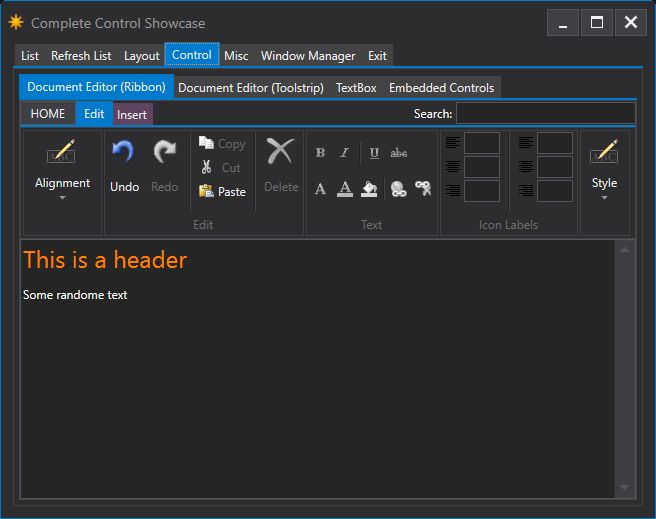

### Aurora

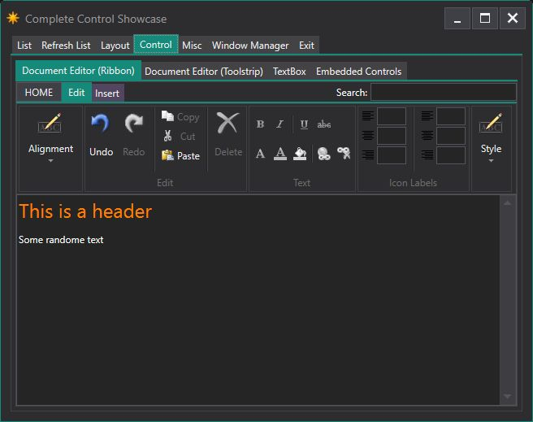

### Ember

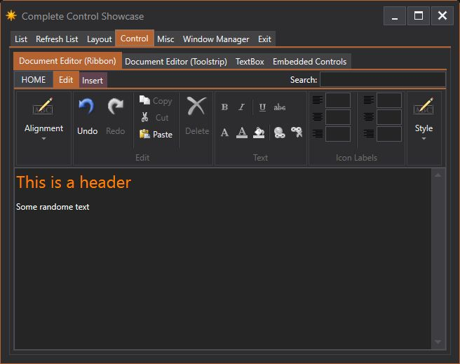

### Lagoon

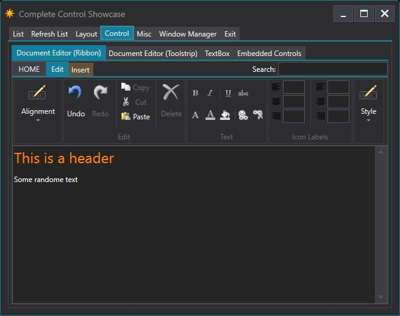

### Moonstone

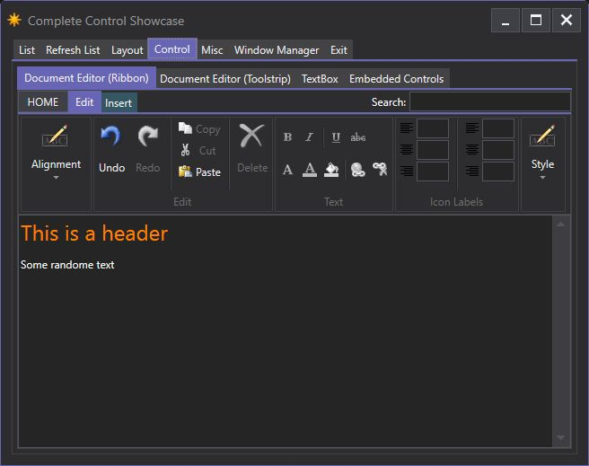

### Rosewood

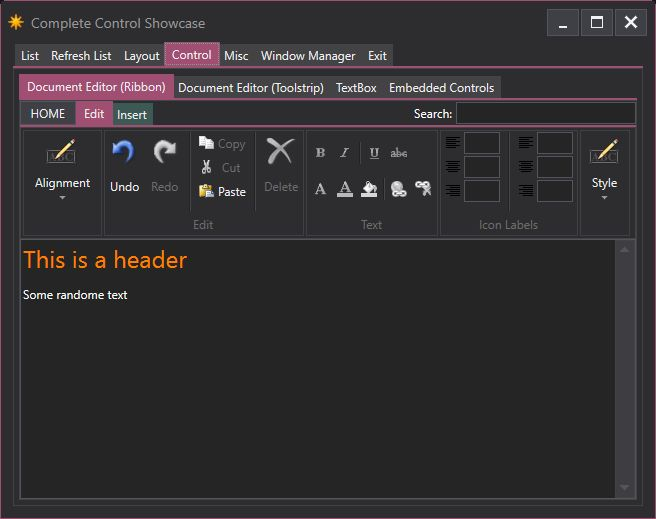

## TuiControlTest

### SkyBlue (default)

.png)

### Emerald

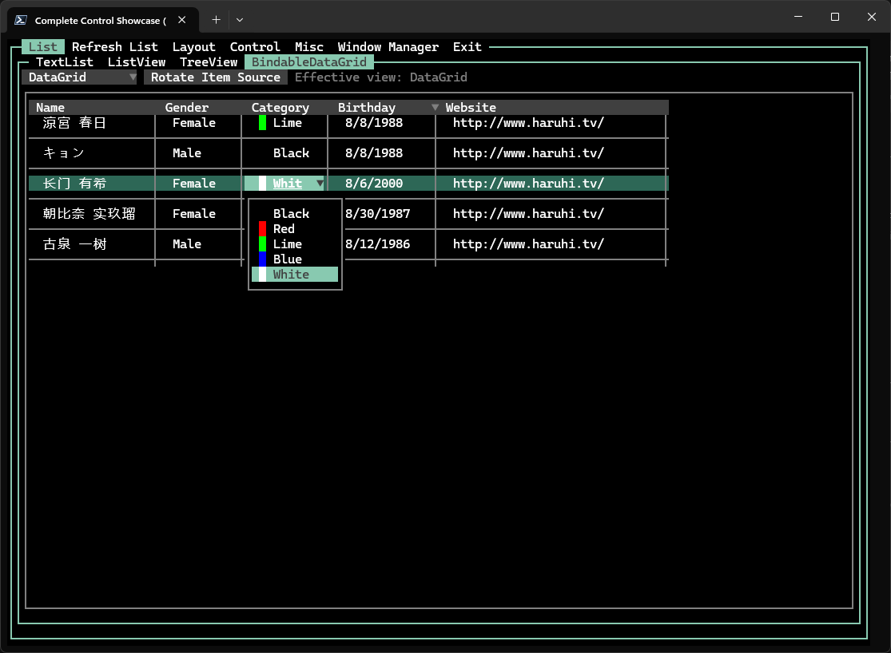

### Grass

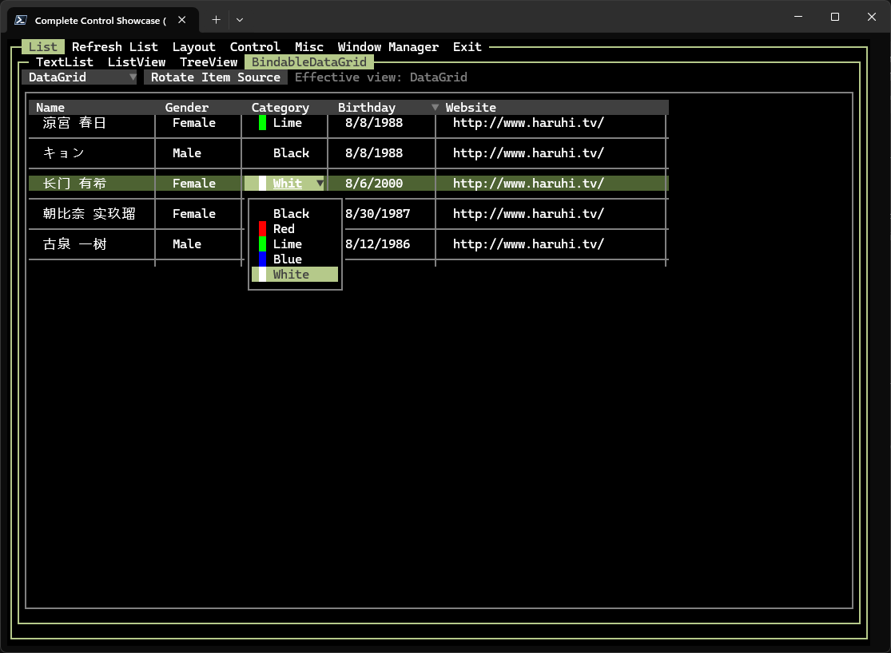

### Orange

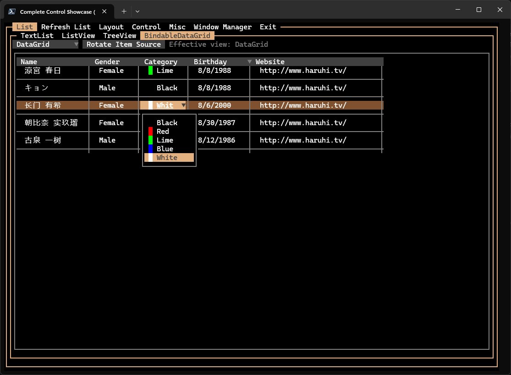

### Pink

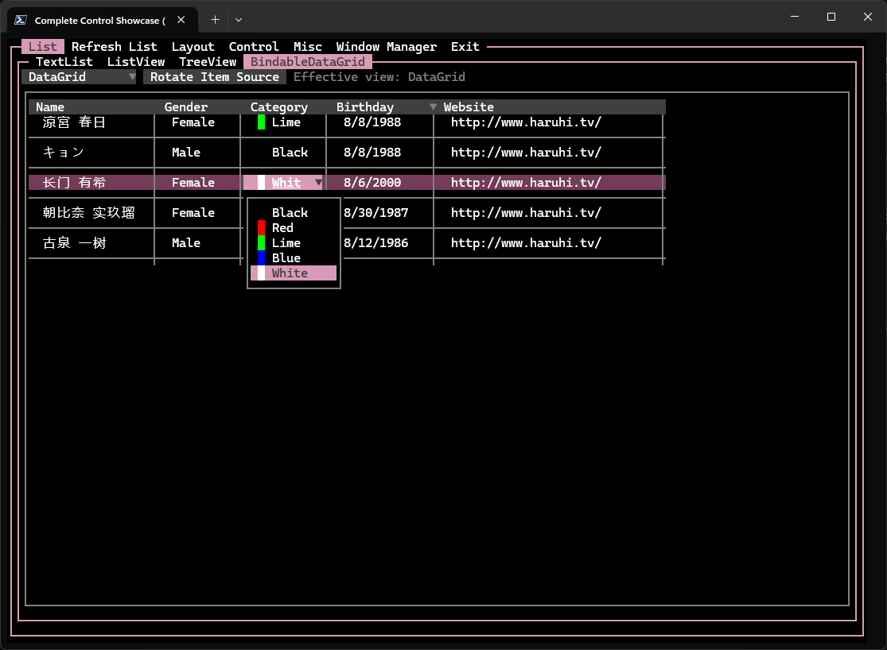

### Purple

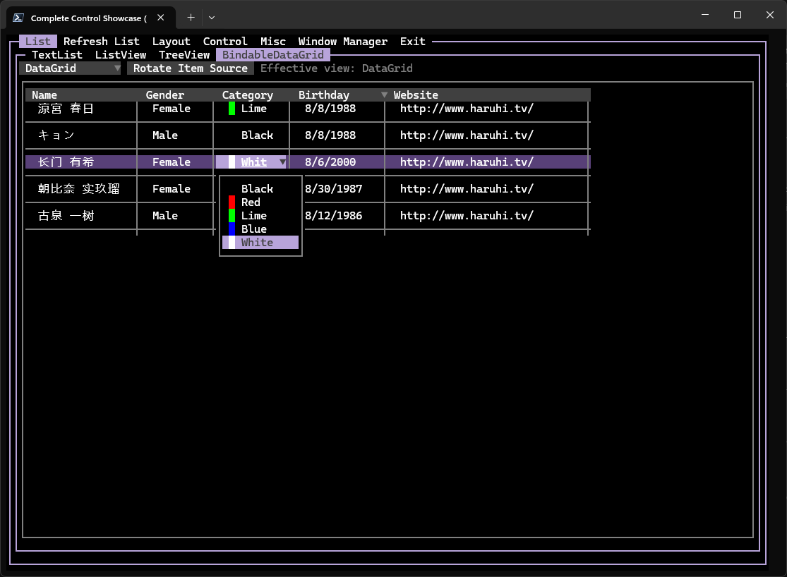
